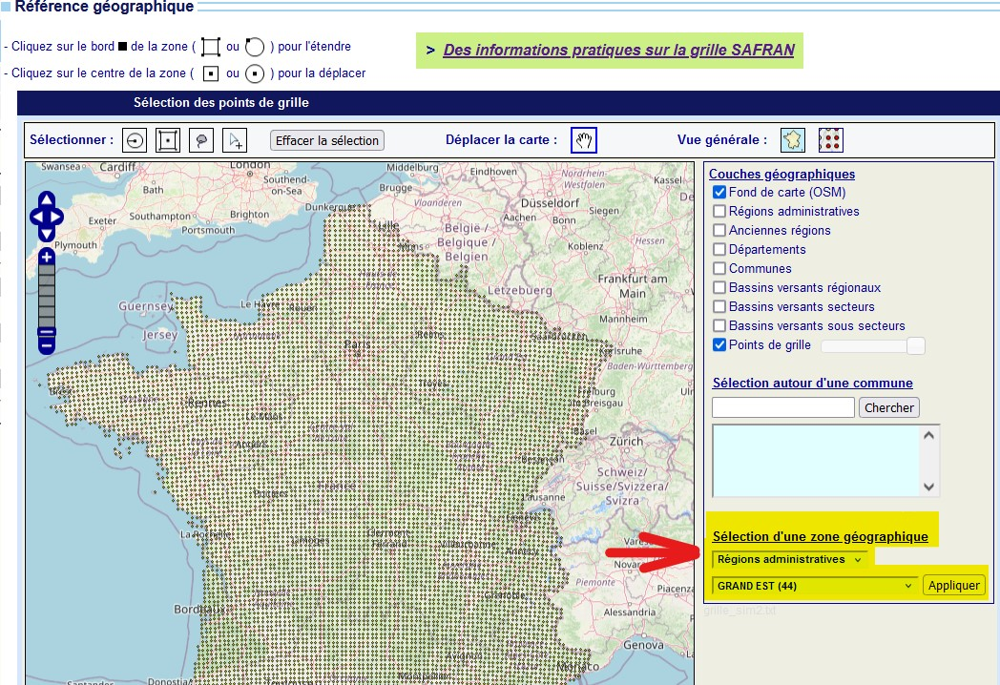
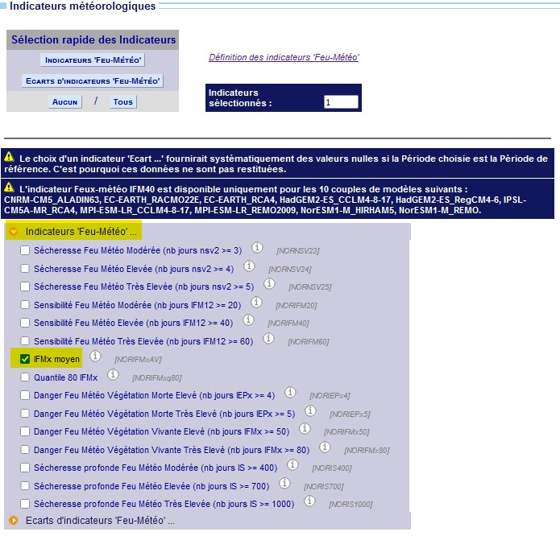
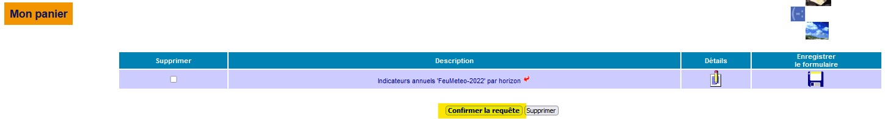
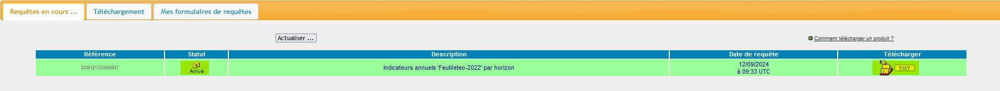

```{r setup, include=FALSE}
knitr::opts_chunk$set(echo = TRUE)
```

```{r load_packages, include=FALSE}
library(happign)
library(raster)
library(terra)
library(dplyr)
library(stars)
library(readxl)
library(tmap)
library(mapedit)
library(tidyverse)
library(sf)
library(tinytex)
library(ggplot2)

```

# Introduction

Les changements climatiques impliquent une augmentation du risque de feux de forêt en France ([`Lerat & Poss, 2021`](https://doi.org/10.20870/revforfr.2021.7209); [`Pimont et al., 2023`](https://hal.inrae.fr/hal-04149936)). L'anticipation est considérée comme un des leviers de la lutte contre les feux de forêt ([`Michaut, 2009`](https://hal.science/hal-03556263)). Les données que MeteoFrance met à disposition sur le [`portail DRIAS`](https://www.drias-climat.fr/commande) permettent d'anticiper le risque incendie à l'aide de la méthode canadienne d'Indice Feu Météorologique (IFM).

L'objectif de ce projet est d'étudier de quelle manière les données DRIAS peuvent être combinées aux données IGN dans une fonction R pour être utiles à la gestion forestière. La méthode de caractérisation du risque incendie sera présentée, ainsi que la manière dont les données ont été acquises puis traitées. Les sorties de la fonction seront ensuite détaillées, puis une partie de discussion des résultats et de proposition de réflexion sera abordée.

# Méthode

## Données DRIAS

### Présentation des données

La méthode d'Indice Feu Météorologique (IFM) permet de caractériser la propension d'un feu à s'aggraver et à se propager à l'aide de variables météorologiques (température, humidité de l'air, vitesse du vent et cumul des précipitations). L'IFM est ensuite représenté sur une maille [`SAFRAN`](https://doi.org/10.57745/1PDFNL) de 8 km par 8 km.

Deux manières de l'estimer sont possibles. La première consiste à se baser sur des relevés historiques pour calculer cet indice *a posteriori* ; la seconde consiste à utiliser des modèles climatiques pour simuler les conditions météorologiques du futur. Ces modèles se basent sur des hypothèses d'émissions de $CO_2$ dans l'atmosphère, exprimées en scénarios de forçage radiatif (Representative Concentration Pathway, RCP). Quatre trajectoires sont possibles : RCP 2.6, RCP 4.5, RCP 6.0 et RCP 8.5 du plus au moins optimiste.

Au-delà des scénarios RCP, plusieurs modèles sont disponibles, qui se différencient par leur prise en compte des processus à l'oeuvre dans le cadre des changements climatiques. Les scénarii de référence, basés sur des données historiques, diffèrent donc également. Onze modèles sont disponibles sur le portail DRIAS.

### Téléchargement des données

La méthode suivante a été appliquée pour télécharger les données DRIAS :

1.  Créer un compte sur l'[`espace de Données et Produits du portail DRIAS`](https://www.drias-climat.fr/commande)`.`

2.  Sur la page "Catalogue des produits", sélectionner "Indicateurs FeuMeteo-2022" dans le sous-dossier "Risques Naturels - Feux de forêts".

    

3.  Un formulaire de téléchargement s'ouvre.

    -   La partie **Sélection du jeu de données** consiste à choisir le modèle climatique utilisé pour représenter les conditions climatiques. Le présent projet se base sur le modèle MeteoFrance ALADIN63. Son intérêt est d'être un modèle régional de climat se basant sur les données d'observations [`SAFRAN`](https://recherche.data.gouv.fr/fr/jeu-de-donnee/geopackage-des-mailles-safran-meteo-france-en-france-metropolitaine-integrant-des-variables-administratives-agricoles-et-hydriques). Ces observations concernent la France métropolitaine selon un maillage de 8 km x 8 km.

    -   La partie **Référence temporelle** permet de déterminer l'horizon temporel des données à charger. Pour le modèle de référence, seule la période de référence est disponible. Pour les modèles projetés, les horizons proche (2021-2050), moyen (2041-2070) et lointain (2071-2100) sont disponibles. Pour ce projet, les indices IFM pour les trois horizons sont téléchargés.

    -   La partie **Référence géographique** permet de sélectionner les mailles SAFRAN dans lesquelles les données DRIAS sont stockées. Pour ce projet, les mailles sont sélectionnées à l'aide des menus déroulants de la partie **Sélection d'une zone géographique**. Elles correspondent à la région administrative Grand-Est (902 mailles), mais les mailles sur la France entière peuvent également être téléchargées. Cliquer sur **Appliquer** pour valider la sélection.

        

    -   La partie **Indicateurs météorologiques** permet de sélectionner les variables à télécharger. Pour ce projet, seule la variable *IFMx moyen* est utilisée. Elle correspond à l'Indicateur de Feu Météorologique, retravaillé par MeteoFrance pour correspondre à la valeur maximale journalière. Comme ce projet se base sur les indicateurs annuels, ces valeurs sont moyennées sur l'année.

        Pour sélectionner la variable, cliquer sur le menu déroulant **Indicateurs 'Feu-Météo'...** et sélectionner la variable d'intérêt. La boîte **Indicateurs sélectionnés** rappelle le nombre de variables sélectionnées.

        {width="440"}

    -   La partie **Validation du formulaire de commande** permet enfin de valider la sélection.

4.  La fenêtre **Mon panier** s'ouvre (cliquer sinon sur le menu **Mon panier** en haut à gauche). Pour envoyer la demande, cliquer sur **Confirmer la requête**.

    

5.  Cliquer ensuite sur le menu **Mes requêtes \> Requêtes en cours...** pour afficher le statut de la demande. Une fois le statut défini sur *Arrivé*, cliquer sur l'icône *TXT* à droite pour télécharger le fichier .txt contenant les données IFMx des grilles sélectionnées.

    

6.  Si le fichier .txt s'ouvre dans une fenêtre du navigateur, faire un Clic droit \> Enregistrer sous... pour enregistrer le fichier .txt.

    Le code R qui suit permet de lire les données.

### Présentation du GeoPackage des mailles SAFRAN

### Lecture des données DRIAS sur R

La fonction suivante permet de lire les données DRIAS et retourne un geopackage ayant pour couches les données DRIAS aux horizons i) proche, ii) moyen et iii) lointain.

Elle prend en entrée un dataframe construit à partir du fichier .txt téléchargé sur le portail DRIAS, ainsi que le geopackage des mailles SAFRAN en France métropolitaine.

```{r lecture_donnees}
indices_feu <- read.table(
    "indicesALADIN63_CNRM-CM5_24090913012904838.KEYuAuU7dD1Uudu0Od00fOx.txt",
    sep = ";",
    quote = "\"")

safran <- st_read("safran.gpkg")
```

```{r fonction_drias}
get.drias.gpkg <-
  function(safran = safran,
           indices_feu = indices_feu,
           nomGPKG) {
    # Transformation de indices_feu au format sf ----
    
    indices_feu_sf <-
      st_as_sf(indices_feu, coords = c("V3", "V2"), crs = 4326)
    
    # Indices_feu_sf <- terra::project(indices_feu_sf, "EPSG:2154")
    # La projection à l'aide de la fonction terra::project ne fonctionne pas pour les objets sf
    
    indices_feu_sf <- st_transform(indices_feu_sf, crs = 2154)
    
    #  Reprojection de la couche safran en L93 ----
    
    safran <- st_transform(safran, crs = 2154)
    
    # Jointure des couches safran et drias ----
    
    safran_drias <- st_join(safran, indices_feu_sf)
    
    safran_drias <- safran_drias[!is.na(safran_drias$V1),]
    
    
    # Séparation de la couche DRIAS selon les trois horizons
    
    safran_drias_proche <- safran_drias[safran_drias$V5 == "H1",]
    safran_drias_moyen <- safran_drias[safran_drias$V5 == "H2",]
    safran_drias_lointain <-
      safran_drias[safran_drias$V5 == "H3",]
    
    
    # Arrondi des indicateurs à l'unité
    
    safran_drias$V12 <- round(safran_drias$V12, 0)
    safran_drias$V12 <- as.integer(safran_drias$V12)
    

    # Rasterisation des couches DRIAS    
    
    raster_drias_proche <-
      stars::st_rasterize(safran_drias_proche %>%
                            dplyr::select(V12,
                                          location))
    raster_drias_moyen <-
      stars::st_rasterize(safran_drias_moyen %>%
                            dplyr::select(V12,
                                          location))
    raster_drias_lointain <-
      stars::st_rasterize(safran_drias_lointain %>%
                            dplyr::select(V12,
                                          location))
    
    raster_drias_proche <- as(raster_drias_proche, "SpatRaster")
    raster_drias_moyen <- as(raster_drias_moyen, "SpatRaster")
    raster_drias_lointain <- as(raster_drias_lointain, "SpatRaster")
    
    
    # Ecriture des couches raster dans un geopackage ----
    
    writeRaster(
      raster_drias_proche,
      paste0(nomGPKG, ".gpkg"),
      filetype = "GPKG",
      gdal = c(
        "APPEND_SUBDATASET=YES",
        "RASTER_TABLE=IFMX_RCP8_5_PROCHE"
      )
    )
    writeRaster(
      raster_drias_moyen,
      paste0(nomGPKG, ".gpkg"),
      filetype = "GPKG",
      gdal = c("APPEND_SUBDATASET=YES",
               "RASTER_TABLE=IFMX_RCP8_5_MOYEN")
    )
    writeRaster(
      raster_drias_lointain,
      paste0(nomGPKG, ".gpkg"),
      filetype = "GPKG",
      gdal = c(
        "APPEND_SUBDATASET=YES",
        "RASTER_TABLE=IFMX_RCP8_5_LOINTAIN"
      )
    )
    
  }
```

Voies carrossables : 50% des feux se déclarent à moins de 50 mètres d'une voie carrossable, et 40% à moins de 50 mètres d'une habitation ([`Lafarge, 2006`](https://infodoc.agroparistech.fr/visionneuse.php?lvl=afficheur&explnum=4152#page/19/mode/1up)).

```{r fonction-inflammibilite}
peuplement_inflammabilite <- function(X){
  pplt_aleatoire <- happign::get_wfs(X,"LANDCOVER.FORESTINVENTORY.V2:formation_vegetale")
  
  pplt_aleatoire$inflammability <- ifelse(
    pplt_aleatoire$tfv_g11 == "Forêt fermée feuillus", 20,
    ifelse(pplt_aleatoire$tfv_g11== "Forêt fermée sans couvert arboré",10,
           ifelse(pplt_aleatoire$tfv_g11 == "Forêt ouverte feuillus", 30,
                  ifelse(pplt_aleatoire$tfv_g11 == "Forêt fermée conifères", 70,
                         ifelse(pplt_aleatoire$tfv_g11 == "Forêt ouverte conifères", 80,
                                ifelse(pplt_aleatoire$tfv_g11 == "Lande", 50,
                                       ifelse(pplt_aleatoire$tfv_g11 == "Peupleraie", 10, 50)))))))
  
  
  inflama_raster <- stars::st_rasterize(pplt_aleatoire %>% 
                                          dplyr::select(inflammability, geometry))
  
  return(inflama_raster)
}
```

## Prise en compte de l'inflammabilité

Le premier facteur choisi pour caractériser le risque incendie est l'inflammabilité des peuplements. Cela correspond à la propriété d'une essence caractérisant sa capacité à s'enflammer lorsqu'il est soumis à un échauffement. La notion d'inflammabilité ainsi que l'analyse de ses variations est fondamentale pour le suivi de l'évolution du risque d'éclosion d'incendies que présentent les principales espèces en tenant compte de leur place respective dans les diverses formations forestières. La hiérarchisation de ce facteur de risque en fonction des essences constitue donc une première étape dans la cartographie de zones à risque.([JC Valette],[Inflammabilité des essences méditérannéennes, Conséquences sur la combustibilité des formations forestières]) En s'inspirant des données du travail de JC Valette, la hierarchie des essences a été faite de manière simplifiée en s'appuyant sur les données fournies par l'IGN pour caractériser les peuplements (tfv_g11). Ainsi sont pris en comptes, d'un côté, les forêts de feuillus ouvertes et fermées et d'un autre les forêts de conifères ouvertes et fermées. Des cas particuliers ont été pris en compte pour les forêts à peuplement mixte, les landes et les peupleraies (le risque étant quasi nul en ripisylve). Une note particulière dans le champ des dizaines a été attribuée pour chacun des peuplements de la zone sélectionée, caractérisant ainsi leur inflammabilité. La fonction ci-dessus renvoie ainsi les peuplements de la zone comme des objets raster.

```{r fonction combustibilite}
peuplement_combustibilite <- function(X) {
  pplt_aleatoire <-
    happign::get_wfs(X, "LANDCOVER.FORESTINVENTORY.V2:formation_vegetale")
  
  pplt_aleatoire$combustibility <- ifelse(
    pplt_aleatoire$tfv_g11 == "Forêt fermée feuillus",
    80,
    ifelse(
      pplt_aleatoire$tfv_g11 == "Forêt fermée sans couvert arboré",
      75,
      ifelse(
        pplt_aleatoire$tfv_g11 == "Forêt ouverte feuillus",
        70,
        ifelse(
          pplt_aleatoire$tfv_g11 == "Forêt fermée conifères",
          30,
          ifelse(
            pplt_aleatoire$tfv_g11 == "Forêt ouverte conifères",
            20,
            ifelse(
              pplt_aleatoire$tfv_g11 == "Lande",
              50,
              ifelse(pplt_aleatoire$tfv_g11 == "Peupleraie", 70, 50)
            )
          )
        )
      )
    )
  )
  
  combusti_raster <- stars::st_rasterize(pplt_aleatoire %>%
                                           dplyr::select(combustibility, 
                                                         geometry),)
  return(combusti_raster)
}

```

## Prise en compte du facteur combustibilité

L'inflammabilité n'est pas un facteur suffisant pour caractériser le risque incendie à l'échelle des peuplements d'une zone. En effet, certaines essences peuvent être très facilement inflammables mais pas nécessairement très combustibles, c'est à dire ayant la propriété de brûler en se combinant avec l'oxygène de l'air ou un autre comburant. Ce sont les feuillus qui ont le plus fort pouvoir calorifique et ainsi la meilleure capacité de combustibilité. La méthode de sélection, d'attribution d'une note (dans le champ des centaines) pour hiérarchiser les peuplements en fonction du risque ainsi que la rastérisation des couches s'effectuent de la même façon que pour l'inflammabilité.

```{r fonction desserte}
fonction_desserte <- function (shp) {
  desserte <- happign::get_wfs(shp, "BDTOPO_V3:troncon_de_route")
  
  desserte_accessible_V <- subset(desserte, nature != "Sentier")
  
  desserte_accessible_V <-
    subset(desserte_accessible_V, nature != "Escalier")
  
  desserte_accessible_V$score[desserte_accessible_V$nature == "Route empierrée"] <-
    5
  
  desserte_accessible_V$score[desserte_accessible_V$nature == "Route à 1 chaussée"] <-
    2
  
  desserte_accessible_V$score[desserte_accessible_V$nature == "Route à 2 chaussées"] <-
    1
  
  desserte_accessible_V$score[desserte_accessible_V$nature == "Chemin"] <-
    9
  
  raster_desserte <- st_rasterize(desserte_accessible_V %>%
                                    dplyr::select(score))
  
  return(raster_desserte)
}
```

```{r_sous-fonction bâtiments sensibles}
fonction_bat <- function (X,
                          buffer = 50){
  batiment <- happign::get_wfs(X,"BDTOPO_V3:batiment")
  print(st_crs(batiment)) 
  
  batiment_buf <- st_buffer(x = batiment, 50)
  
  intersections <- st_intersects(batiment_buf, batiment)
  
  batiment_buf$nb_batiments <- lengths(intersections)
  
  batiment_buf$classe_bâtis <- ifelse(
    batiment_buf$nb_batiments <= 3,"bâtis isolé",
    ifelse(batiment_buf$nb_batiments <= 50,"bâtis diffus","bâtis sans classe"))
                             
  batiment_buf$score <- case_when(
    batiment_buf$classe_bâtis == "bâtis isolé" ~ 1,       
    batiment_buf$classe_bâtis == "bâtis diffus" ~ 2,     
    batiment_buf$classe_bâtis == "bâtis sans classe" ~ 3)
  
  raster_batiment <- stars::st_rasterize(batiment_buf %>% 
                                           dplyr::select(score))
  write_stars(raster_batiment, "batiment.tif")
  
  return(raster_batiment)
}
```
# Prise en compte des bâtiments à risque 

Il semble également important de repérer et de classifier les bâtiments dans les zones forestières sélectionnées pour prendre en compte le risque matériel et implicitement humain dans les zones à risque. Pour cela, l'utilisation de la BDTOPO bâtiments de l'IGN a été privilégiée pour repérer les bâtiments de la zone (identique à celle précedemment sélectionnée). Une zone buffer de 50 m autour des infrastructures sélectionnées a été faite pour matérialiser le risque géographique lié aux incendies et à leur propagation. Pour catégoriser le risque de façon plus précise et plus simple pour lui créer une note, un comptage des bâtiments appartenant à une même zone buffer a été effectué aboutissant à 3 classes de bâtis : isolé (moins de 3 bâtiments dans la zone buffer), diffus (entre 3 et 50 bâtiments) ou sans classe (plus de 50). Ces zones buffer sont ensuite rasterisées pour être visulaisées via un fichier tif.


# Bibliographie

> > > > > > > ea47431e3c902c66766a5ef6c096bf8c9e0b80f9
