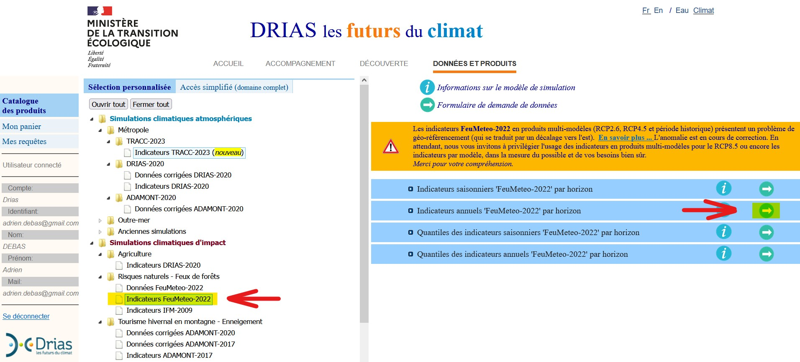

```{r setup, include=FALSE}
knitr::opts_chunk$set(echo = TRUE)
```

# Introduction

Les changements climatiques impliquent une augmentation du risque de feux de forêt en France ([`Lerat & Poss, 2021`](https://doi.org/10.20870/revforfr.2021.7209); [`Pimont et al., 2023`](https://hal.inrae.fr/hal-04149936)). L'anticipation est considérée comme un des leviers de la lutte contre les feux de forêt ([`Michaut, 2009`](https://hal.science/hal-03556263)). Les données que MeteoFrance met à disposition sur le [`portail DRIAS`](https://www.drias-climat.fr/commande) permettent d'anticiper le risque incendie à l'aide de la méthode canadienne d'Indice Feu Météorologique (IFM).

L'objectif de ce projet est d'étudier de quelle manière les données DRIAS peuvent être combinées aux données IGN dans une fonction R pour être utiles à la gestion forestière. La méthode de caractérisation du risque incendie sera présentée, ainsi que la manière dont les données ont été acquises puis traitées. Les sorties de la fonction seront ensuite détaillées, puis une partie de discussion des résultats et de proposition de réflexion sera abordée.

# Méthode

## I) Données DRIAS

### a. Présentation des données

La méthode d'Indice Feu Météorologique (IFM) permet de caractériser la propension d'un feu à s'aggraver et à se propager à l'aide de variables météorologiques (température, humidité de l'air, vitesse du vent et cumul des précipitations). L'IFM est ensuite représenté sur une maille [`SAFRAN`](https://doi.org/10.57745/1PDFNL) de 8 km par 8 km.

Deux manières de l'estimer sont possibles. La première consiste à se baser sur des relevés historiques pour calculer cet indice *a posteriori* ; la seconde consiste à utiliser des modèles climatiques pour simuler les conditions météorologiques du futur. Ces modèles se basent sur des hypothèses d'émissions de $CO_2$ dans l'atmosphère, exprimées en scénarios de forçage radiatif (Representative Concentration Pathway, RCP)

### b. Téléchargement des données

La méthode suivante a été appliquée pour télécharger les données DRIAS :

1.  Créer un compte sur l'[`espace de Données et Produits du portail DRIAS`](https://www.drias-climat.fr/commande)`.`

2.  Sur la page "Catalogue des produits", sélectionner "Indicateurs FeuMeteo-2022" dans le sous-dossier "Risques Naturels - Feux de forêts".

    

3.  Un formulaire de téléchargement s'ouvre.

Voies carrossables : 50% des feux se déclarent à moins de 50 mètres d'une voie carrossable, et 40% à moins de 50 mètres d'une habitation ([`Lafarge, 2006`](https://infodoc.agroparistech.fr/visionneuse.php?lvl=afficheur&explnum=4152#page/19/mode/1up)).

```{r_fonction-inflammibilite}
peuplement_inflammabilite <- function(X){
  pplt_aleatoire <- happign::get_wfs(X,"LANDCOVER.FORESTINVENTORY.V2:formation_vegetale")
  
  pplt_aleatoire$inflammability <- ifelse(
    pplt_aleatoire$tfv_g11 == "Forêt fermée feuillus", 20,
    ifelse(pplt_aleatoire$tfv_g11== "Forêt fermée sans couvert arboré",10,
           ifelse(pplt_aleatoire$tfv_g11 == "Forêt ouverte feuillus", 30,
                  ifelse(pplt_aleatoire$tfv_g11 == "Forêt fermée conifères", 70,
                         ifelse(pplt_aleatoire$tfv_g11 == "Forêt ouverte conifères", 80,
                                ifelse(pplt_aleatoire$tfv_g11 == "Lande", 50,
                                       ifelse(pplt_aleatoire$tfv_g11 == "Peupleraie", 10, 50)))))))
  
  
  inflama_raster <- stars::st_rasterize(pplt_aleatoire %>% 
                                          dplyr::select(inflammability, geometry))
  
  return(inflama_raster)
}
```

# Prise en compte de l'inflammabilité

Le premier facteur choisi pour caractériser le risque incendie est l'inflammabilité des peuplements. Cela correspond à la propriété d'une essence caractérisant sa capacité à s'enflammer lorsqu'il est soumis à un échauffement. La notion d'inflammabilité ainsi que l'analyse de ses variations est fondamentale pour le suivi de l'évolution du risque d'éclosion d'incendies que présentent les principales espèces en tenant compte de leur place respective dans les diverses formations forestières. La hiérarchisation de ce facteur de risque en fonction des essences constitue donc une première étape dans la cartographie de zones à risque.([JC Valette],[Inflammabilité des essences méditérannéennes, Conséquences sur la combustibilité des formations forestières]) En s'inspirant des données du travail de JC Valette, la hierarchie des essences a été faite de manière simplifiée en s'appuyant sur les données fournies par l'IGN pour caractériser les peuplements (tfv_g11). Ainsi sont pris en comptes, d'un côté, les forêts de feuillus ouvertes et fermées et d'un autre les forêts de conifères ouvertes et fermées. Des cas particuliers ont été pris en compte pour les forêts à peuplement mixte, les landes et les peupleraies (le risque étant quasi nul en ripisylve). Une note particulière dans le champ des dizaines a été attribuée pour chacun des peuplements de la zone sélectionée, caractérisant ainsi leur inflammabilité. La fonction ci-dessus renvoie ainsi les peuplements de la zone comme des objets raster.

```{r_fonction combustibilite}
peuplement_combustibilite <- function(X){
  pplt_aleatoire <- happign::get_wfs(X,"LANDCOVER.FORESTINVENTORY.V2:formation_vegetale")
  
  pplt_aleatoire$combustibility <-ifelse(
    pplt_aleatoire$tfv_g11 == "Forêt fermée feuillus", 800,
    ifelse(pplt_aleatoire$tfv_g11== "Forêt fermée sans couvert arboré",750,
           ifelse(pplt_aleatoire$tfv_g11 == "Forêt ouverte feuillus",700,
                  ifelse(pplt_aleatoire$tfv_g11 == "Forêt fermée conifères", 300,
                         ifelse(pplt_aleatoire$tfv_g11 == "Forêt ouverte conifères", 200,
                                ifelse(pplt_aleatoire$tfv_g11 == "Lande", 500,
                                       ifelse(pplt_aleatoire$tfv_g11 == "Peupleraie", 700, 500)))))))
  
  combusti_raster <- stars::st_rasterize(pplt_aleatoire %>% 
                                           dplyr::select(combustibility, geometry),
                                         )
  return(combusti_raster)
}

```

# prise en compte du facteur combustibilité

L'inflammabilité n'est pas un facteur suffisant pour caractériser le risque incendie à l'échelle des peuplements d'une zone. En effet, certaines essences peuvent être très facilement inflammables mais pas nécessairement très combustibles, c'est à dire ayant la propriété de brûler en se combinant avec l'oxygène de l'air ou un autre comburant. Ce sont les feuillus qui ont le plus fort pouvoir calorifique et ainsi la meilleure capacité de combustibilité. La méthode de sélection, d'attribution d'une note (dans le champ des centaines) pour hiérarchiser les peuplements en fonction du risque ainsi que la rastérisation des couches s'effectuent de la même façon que pour l'inflammabilité.

```{r_fonction desserte}
fonction_desserte <- function (shp){
  desserte <- happign::get_wfs(shp, "BDTOPO_V3:troncon_de_route")
  
  desserte_accessible_V <- subset(desserte, nature!="Sentier")
  
  desserte_accessible_V <- subset(desserte_accessible_V, nature!="Escalier")
  
  desserte_accessible_V$score[desserte_accessible_V$nature=="Route empierrée"] <- 5
  
  desserte_accessible_V$score[desserte_accessible_V$nature=="Route à 1 chaussée"] <- 2
  
  desserte_accessible_V$score[desserte_accessible_V$nature=="Route à 2 chaussées"] <- 1
  
  desserte_accessible_V$score[desserte_accessible_V$nature=="Chemin"] <- 9

  raster_desserte <- st_rasterize(desserte_accessible_V %>% 
                                    dplyr::select(score)) 
  
  return(raster_desserte)
}
```

# Importance de la desserte forestière

# Bibliographie
